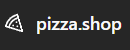
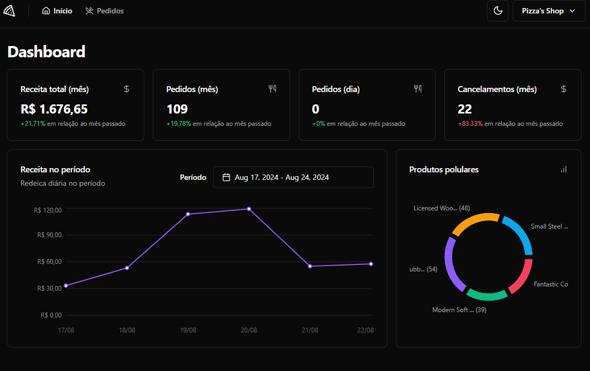
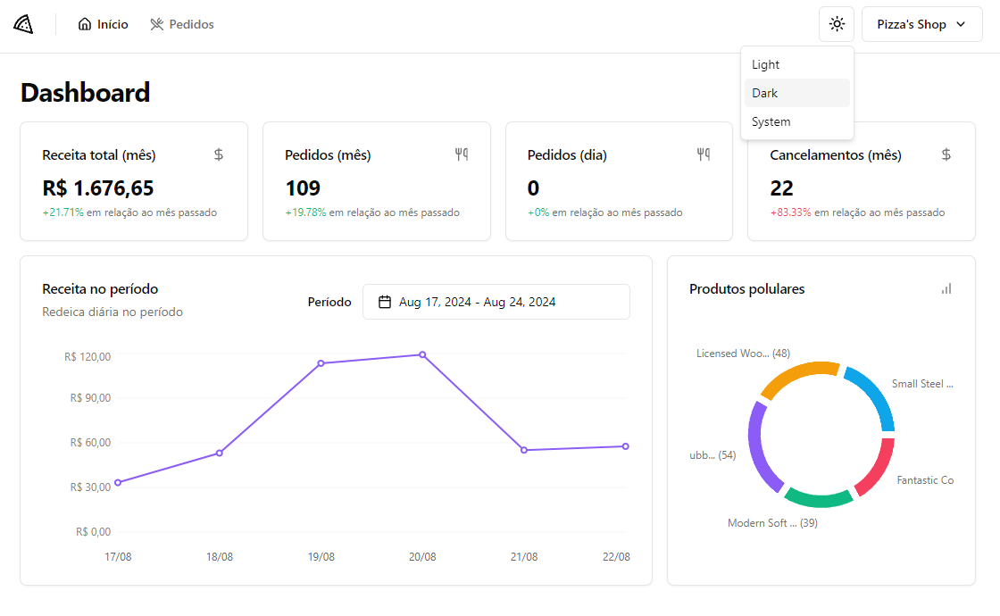
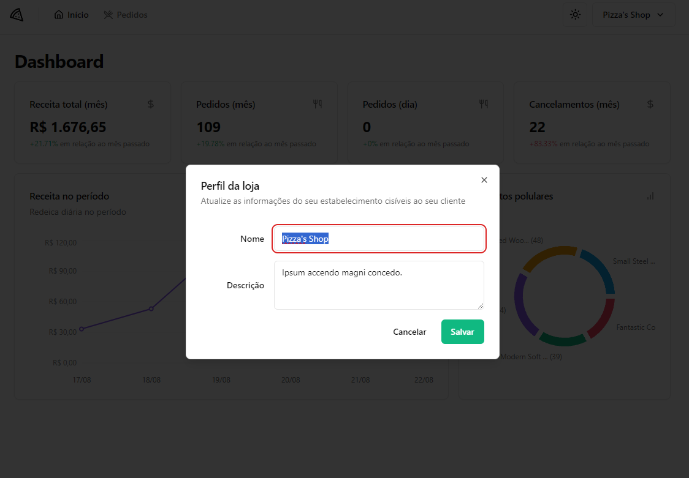
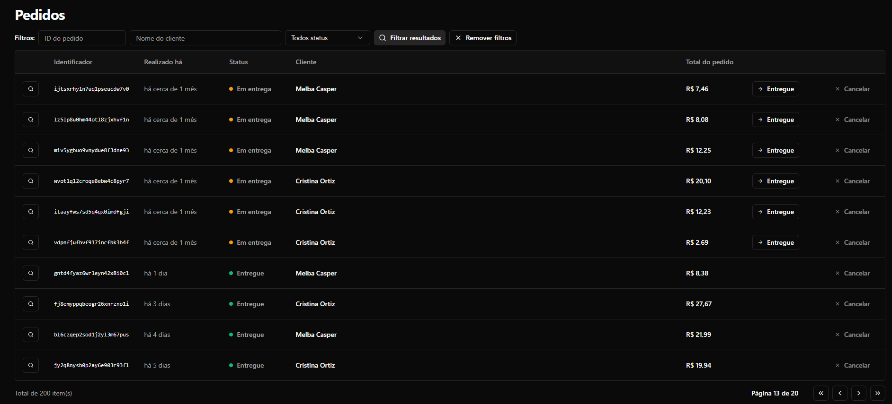
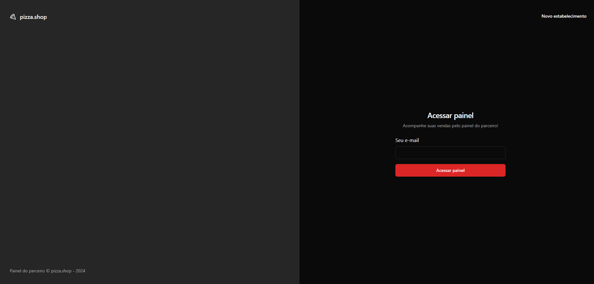
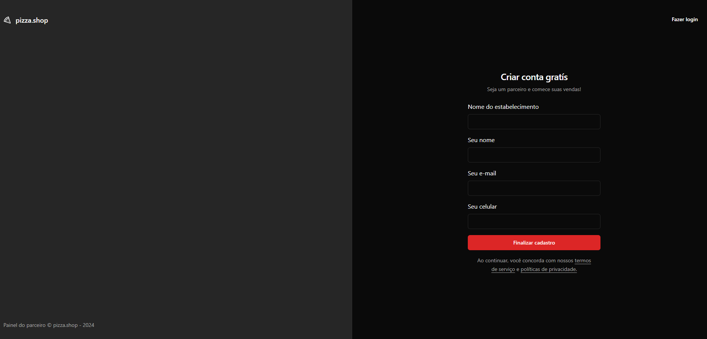

<h1 align="center">
  
</h1>

<h3 align="center">
  pizza.shop - An app to manage your delivery company
</h3>

<h1 align="center">
  
  
  
  
  
  
</h1>

<p align="center">
  

  <a href="https://www.linkedin.com/in/luishng/">
    
  </a>

  

  <a href="https://github.com/luishng/pizzaShop/commits/main">
    
  </a>

  <a href="https://github.com/luishng/pizzaShop/issues">
    
  </a>

  
</p>

# :pushpin: Table of Contents

<p align="center">
  <a href="#recycle-about-the-project">About the project</a>&nbsp;&nbsp;&nbsp;|&nbsp;&nbsp;&nbsp;
  <a href="#-technologies">Technologies</a>&nbsp;&nbsp;&nbsp;|&nbsp;&nbsp;&nbsp;
  <a href="#-getting-started">Getting Started</a>&nbsp;&nbsp;&nbsp;|&nbsp;&nbsp;&nbsp;
  <a href="#-features">Features</a>&nbsp;&nbsp;&nbsp;|&nbsp;&nbsp;&nbsp;
  <a href="#-license">License</a>
</p>

## 🏋🏽💪🏼 About the project

This project was developed in Specialization from [Rocketseat](https://rocketseat.com.br/) &nbsp;🚀

This software a mobile web application, provide a way for the people control your deliver company in this case a pizza shop.

## 🚀 Technologies

**Language:**

- [TypeScript](https://www.typescriptlang.org/)

**Web:**

- [React](https://react.dev/) - React programming paradigm
- [Vite](https://vitejs.dev/) - Framework
- [React Hook Form](https://react-hook-form.com/) - Form Controller
- [React Router DOM](https://reactrouter.com/) - Router
- [TanStack Query](https://tanstack.com/query/) - State Management
- [Axios](https://axios-http.com/) - HTTP Client
- [Tailwind](https://tailwindcss.com/) - "CSS framework"
- [Shadcn/UI](https://ui.shadcn.com/) - "Component library"
- [Lucide](https://lucide.dev/) - Free Icons
- [Zod](https://zod.dev/) - Schema Validation

## 🔗 Features

- Dashboard with informations about orders of company;
- List of orders;
- Aprove, Cancel, Dispatch, Deliver orders;
- Filter order by Status, Name, Id;
- Sign-up company;
- Sign-in;

## 🏁 Getting Started

**Install the requirements**

- [Git](https://git-scm.com/)
- [Node.js](https://nodejs.org/en/)
- [Yarn](https://classic.yarnpkg.com/) or [npm](https://www.npmjs.com/)

**Clone Back-End project and access the folder**
"I didn't do the backend"

```bash
$ git clone https://github.com/rocketseat-education/pizzashop-api.git && cd pizzashop-api
```

```bash
# Install Bun
https://bun.sh/docs/installation
```

```bash
# Install the dependencies
$ bun i
$ docker compose up -d
$ bun migrate
$ bun seed

# Start the client
$ bun dev
```

**_Let the backend running and use the Project!_**

**Clone Web project and access the folder**

```bash
$ git clone https://github.com/luishng/pizzaShop.git && cd pizzaShop
```

```bash
# Install the dependencies
$ npm i

# Start the client
$ npm start
```

## 📝 License

This project is licensed under the MIT License - see the [LICENSE](LICENSE) file for details.

---

Made with 💜&nbsp; by [Luis Henrique](https://github.com/luishng) 👋 &nbsp;[See my linkedin](https://www.linkedin.com/in/luishng/) 👷
